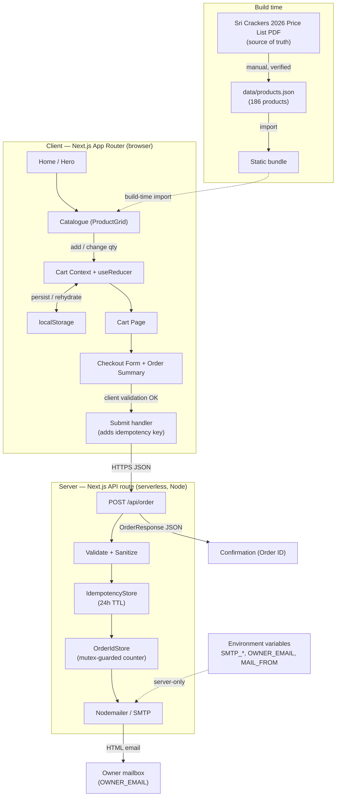

# Design Document

## Overview

This document describes the technical design for the **Sri Crackers** mobile-first online ordering website. The system lets customers browse a fixed catalogue of 186 products (sourced solely from the Sri Crackers 2026 Price List PDF), add items to a cart with enforced minimum quantities, review a live total, submit contact and delivery details, and receive a confirmation while the business owner receives a formatted order email.

The solution is built with **Next.js (App Router)**, **React**, and **TypeScript**, styled with **Tailwind CSS**, animated with **Framer Motion**, and uses a **Next.js serverless API route** with **Nodemailer over SMTP** for email delivery. **No AWS services are used anywhere** — this is an explicit project constraint (Requirements Constraints: *No AWS*; Requirement 9.2). All secrets are read from environment variables and never shipped to the client (Requirements 8.12, 9.3, 9.4, 18.1, 18.2).

Key design goals, mapped to requirements:

- **Mobile-first** layout as the primary target (Req 1.1, 13.1, 13.2).
- **Fast initial load** on slow (3G) networks with lazy-loaded catalogue and minimal client JS (Req 19.1, 19.2, 19.5).
- **Data-driven catalogue** — all product values live in `products.json`, never hard-coded in UI (Req 12.1–12.6).
- **Correct totals and minimum-quantity enforcement** throughout cart and checkout (Req 5.9, 6.1–6.4).
- **Secure, validated, sanitized, idempotent** order submission with unique order IDs, with no database and no AWS (Req 8, 11, 18).

This design covers the architecture, technology decisions, project structure, data models, component contracts, category mapping, backend/API contract, email template, validation rules, state management, responsive/visual design, error handling, testing strategy, correctness properties, and security/performance considerations.

## Architecture

The application is a single Next.js project with two runtime surfaces:

1. **Client (browser)** — React components rendered via the App Router. Handles browsing, searching, filtering, cart state (persisted to `localStorage`), checkout form, client-side validation, and confirmation. The product catalogue is imported from a static `products.json` at build time, so no runtime product fetch is required.
2. **Server (serverless API route)** — `POST /api/order` runs server-side only. It re-validates and sanitizes input, generates a unique Order ID, enforces idempotency, and sends the owner notification email over SMTP. Secrets live only in server-side environment variables.



**Data flow for the end-to-end journey (Req 20):**

1. **Browse** — Catalogue renders from the build-time `products.json` import; category chips and search filter the in-memory list (Req 2, 4).
2. **Cart** — Adding/updating products dispatches actions to the Cart reducer; the Cart Bar reflects item count and Grand Total live (Req 5, 20.1). Cart state is persisted to `localStorage` on every change and rehydrated on load.
3. **Checkout** — The Cart Page proceeds to the Checkout Form, which shows an order summary and collects customer details (Req 7, 20.2).
4. **Submit** — Client validation runs first; on success, the client POSTs the order (with an idempotency key) to `/api/order` and disables the submit button (Req 8.8, 20.3).
5. **Server processing** — The API route re-validates, sanitizes, checks idempotency, generates an Order ID, and sends the owner email (Req 8.9–8.11, 9, 11).
6. **Email + Confirmation** — On success, the owner receives the formatted HTML email and the client shows the Confirmation with the Order ID (Req 9, 10, 20.3). On failure, an error is shown and the submit button is re-enabled (Req 8.8, 20.4).

**Deployment**: The app deploys to Vercel or any Node host. The serverless API route and SMTP transport contain no AWS dependency. For multi-instance deployments, the `OrderIdStore` and `IdempotencyStore` are interfaces designed to be swapped for a shared backing store (e.g., Redis/Upstash) — see Backend / API Design.

## Technology Stack and Decisions

| Concern | Choice | Rationale | Requirements |
|---|---|---|---|
| Framework | **Next.js (App Router) + React + TypeScript** | SSR/SSG gives fast initial load and SEO-friendly HTML; built-in serverless API routes provide the secure backend with no AWS; first-class env-var handling; responsive-friendly; deployable to Vercel or any Node host. TypeScript gives compile-time safety for the data models. | 19.1, 19.4, 9.2, 8.12 |
| Styling | **Tailwind CSS** + CSS custom properties | Utility-first keeps the production CSS small and supports mobile-first responsive design via breakpoint prefixes. CSS custom properties hold the festive gold/red/navy palette tokens for consistency. | 13.1–13.5, 14.1 |
| Animation | **Framer Motion** + lightweight CSS/canvas for hero fireworks | Bounded, GPU-friendly transitions (transform/opacity) for fade-in, cart update, and card tap; honours `prefers-reduced-motion`; keeps ≥30fps. Hero fireworks use a lightweight CSS/canvas effect to avoid heavy JS. | 14.3–14.6, 1.7 |
| State management | **React Context + useReducer** for Cart; `localStorage` persistence | A single reducer centralizes cart logic (add, remove, quantity changes, min-qty enforcement, totals). No external store library is needed for one cart. `localStorage` makes the cart survive reloads. | 5.1–5.9, 6.3, 6.4 |
| Product data | **Static `data/products.json`** (186 products) imported at build time; typed `Product` model; fixed **category→chip** mapping module | Keeps all product values in one structured file, decoupled from UI; no runtime fetch needed; the mapping module assigns every product to exactly one grouped chip. | 12.1–12.6, 2.3 |
| Backend | **Next.js API route `/api/order`** (serverless, server-only) | Validates + sanitizes server-side, generates Order ID, sends email. No AWS. | 8.9–8.12, 9, 11, 18.3, 18.4 |
| Email | **Nodemailer over SMTP**, configured via env vars | SMTP is provider-agnostic and non-AWS. Credentials never reach the client. Resend/SendGrid SMTP work as drop-in alternatives by changing env vars only. | 9.1–9.7, 18.1, 18.2 |
| Order ID + idempotency (no DB) | Persisted counter file via an injectable **`OrderIdStore`** guarded by an in-process async **mutex**; **`IdempotencyStore`** as an in-memory/file-backed map with 24h TTL | Guarantees unique, well-formed IDs across concurrent requests without a database or AWS. Interfaces make both pluggable to a shared store (Redis/Upstash) for multi-instance deployments. | 11.1–11.4, 8.11, 18.5 |
| Input sanitization | Small HTML sanitizer/escaper on all customer fields | Strips/escapes HTML so no markup is interpreted when stored or emailed. | 8.10, 18.4 |
| SEO/performance | Semantic HTML, metadata, lazy-load below-the-fold catalogue, code-splitting, minimal client JS, CSS placeholder treatment for product cards | Meets 3G load target and SEO structure; the price list has no images, so cards use a CSS placeholder treatment rather than fetched images. | 19.1–19.5, 15.1–15.3 |

### No-AWS Justification

The requirements impose an absolute prohibition on AWS (Constraints: *No AWS*; Req 9.2). Every chosen technology satisfies this:

- **Hosting/compute**: Next.js runs on Vercel or any Node host; the serverless API route is part of the Next.js runtime, not AWS Lambda.
- **Email**: Nodemailer talks to a generic SMTP endpoint; the provider is chosen via env vars (e.g., a transactional SMTP service, Resend SMTP, or SendGrid SMTP) — none require AWS SES.
- **Persistence**: Order ID counter and idempotency records use a server-side file (or a pluggable store); there is no S3, DynamoDB, or any AWS data service.
- **No AWS SDKs** are added as dependencies anywhere in the project.

## Project Structure

```
sri-crackers-ordering/
├─ app/
│  ├─ layout.tsx                 # Root layout: metadata, fonts, CartProvider, global styles
│  ├─ page.tsx                   # Home (Hero + CTAs + ContactSection) — Req 1, 17
│  ├─ catalogue/
│  │  └─ page.tsx                # Catalogue_UI: SearchBar + CategoryChips + ProductGrid — Req 2,3,4
│  ├─ cart/
│  │  └─ page.tsx                # Cart_Page — Req 5
│  ├─ checkout/
│  │  └─ page.tsx                # Checkout_Component: form + OrderSummary — Req 7, 8 (client)
│  ├─ confirmation/
│  │  └─ page.tsx                # Confirmation_Component — Req 10
│  └─ api/
│     └─ order/
│        └─ route.ts             # POST /api/order (serverless, server-only) — Req 8,9,11
├─ components/
│  ├─ Header.tsx                 # Logo, name, search icon, cart icon + badge — Req 1.2, 1.3
│  ├─ Hero.tsx                   # Title, tagline, CTAs, fireworks — Req 1.4–1.8, 14.3
│  ├─ SearchBar.tsx              # "🔍 Search crackers..." input — Req 4
│  ├─ CategoryChips.tsx          # All + 7 grouped chips, scrollable row — Req 2.6–2.10
│  ├─ ProductGrid.tsx            # 2-col mobile grid, lazy below-the-fold — Req 3.1, 19.2
│  ├─ ProductCard.tsx            # Name/category/price/unit/min + qty + add — Req 3.2–3.8, 15
│  ├─ QuantitySelector.tsx       # Decrease/value/increase, min-qty aware — Req 3.3, 3.6–3.8
│  ├─ CartBar.tsx                # Sticky bottom bar: count, total, VIEW — Req 5.1–5.3, 20.1
│  ├─ CartList.tsx               # Line items for Cart_Page — Req 5.4–5.8
│  ├─ CheckoutForm.tsx           # "Your Details" fields + validation — Req 7, 8
│  ├─ OrderSummary.tsx           # Pre-submit summary table — Req 7.4
│  ├─ Confirmation.tsx           # Success message + Order ID + buttons — Req 10
│  ├─ BottomNav.tsx              # Home/Categories/Search/Cart — Req 16
│  └─ ContactSection.tsx         # Business + contacts + tel links — Req 17
├─ lib/
│  ├─ cart/
│  │  ├─ CartContext.tsx         # Context + provider + localStorage sync — Req 5, state mgmt
│  │  ├─ cartReducer.ts          # Pure reducer: actions, min-qty, totals — Req 5.9, 6.3, 6.4
│  │  └─ cartTotals.ts           # Pure total/grand-total computations — Req 5.9
│  ├─ validation.ts             # Shared client+server validators — Req 8.1–8.7
│  ├─ sanitize.ts               # HTML escape/strip for customer input — Req 8.10, 18.4
│  ├─ orderId.ts                # OrderIdStore interface + file-backed impl + mutex — Req 11
│  ├─ idempotency.ts            # IdempotencyStore interface + 24h TTL impl — Req 8.11
│  ├─ email/
│  │  ├─ mailer.ts              # Nodemailer transport from env vars — Req 9
│  │  └─ orderEmailTemplate.ts  # HTML email builder — Req 9.5–9.7
│  └─ types.ts                  # Shared TypeScript interfaces (Data Models)
├─ data/
│  ├─ products.json             # All 186 products (source of truth) — Req 12
│  └─ categoryMap.ts            # Fixed detailed-category → chip mapping — Req 2.3
├─ styles/
│  └─ globals.css               # Tailwind layers + CSS custom property palette — Req 14.1
├─ public/                       # Static assets (logo, favicon) — no product photos — Req 15.1
├─ .env.example                 # SMTP_HOST, SMTP_PORT, ... (no real secrets) — Req 18
├─ tailwind.config.ts
├─ next.config.js
├─ tsconfig.json
└─ package.json
```

Server-only modules (`lib/orderId.ts`, `lib/idempotency.ts`, `lib/email/*`, `app/api/order/route.ts`) are never imported by client components, so their code and the secrets they read never enter the client bundle (Req 9.4, 18.2).

## Data Models

All interfaces live in `lib/types.ts` and are shared across client and server.

```typescript
// A grouped chip label used by the Category_Filter (Req 2.3, 2.6).
export type ChipLabel =
  | "Sound" | "Flower" | "Rocket" | "Kids" | "Fancy" | "Sparklers" | "Gift";

// Catalogue item — all fields sourced only from the Price List PDF (Req 12.2, 12.5).
export interface Product {
  id: string;            // stable unique identifier, e.g. "P001"
  name: string;          // product name exactly from the PDF
  category: string;      // detailed PDF category (one of 27) — Req 2.2
  price: number;         // unit price in INR (₹), > 0
  unit: string;          // selling unit from the PDF, e.g. "Box", "Pkt"
  minimumQuantity: number; // Minimum_Quantity, integer >= 1 — Req 6.1
}

// Shape of each record in data/products.json (Req 12.2).
// products.json is: Product[] with exactly 186 entries (Req 12.1, 12.6).

// A single line in the cart/order (Req 5.4, 5.9).
export interface CartLineItem {
  productId: string;
  name: string;          // snapshot of product name for display/email
  unit: string;          // snapshot of unit for the email table
  price: number;         // unit price snapshot (₹)
  minimumQuantity: number; // snapshot used for enforcement (Req 6.4)
  quantity: number;      // current quantity, always >= minimumQuantity
  // Derived (not stored): lineTotal = price * quantity (Req 5.9)
}

// The whole cart (Req 5).
export interface Cart {
  items: CartLineItem[];
  // Derived selectors (computed, not persisted):
  //   distinctCount = items.length                 (Req 1.3, 5.8)
  //   totalQuantity = sum(item.quantity)            (Req 5.8)
  //   grandTotal    = sum(item.price * item.quantity) (Req 5.9)
}

// Customer-provided checkout details (Req 7.2).
export interface CustomerDetails {
  fullName: string;        // required (Req 8.1)
  mobile: string;          // required, 10-digit Indian (Req 8.2, 8.4)
  email?: string;          // optional, format-checked if present (Req 8.5)
  address: string;         // required (Req 8.3)
  city?: string;           // optional
  pincode?: string;        // optional
  notes?: string;          // optional (Customer Notes in email, Req 9.7)
}

// Request body for POST /api/order (Req 8).
export interface OrderRequest {
  idempotencyKey: string;  // client-generated UUID (Req 8.11)
  customer: CustomerDetails;
  items: Array<{
    productId: string;
    quantity: number;
  }>;
  // Server recomputes prices/min-qty from products.json; it does NOT trust
  // client-supplied price/name values (Req 12.5, security).
}

// Response from POST /api/order (Req 10.2, 20.3, 20.4).
export interface OrderResponse {
  success: boolean;
  orderId?: string;        // "SC-2026-NNNNN" on success (Req 11.1)
  grandTotal?: number;     // echoed for the summary view (Req 10.6)
  errors?: ValidationError[]; // field-level validation failures (Req 8.9)
  errorCode?:
    | "VALIDATION"
    | "EMPTY_CART"
    | "MIN_QUANTITY"
    | "ID_EXHAUSTED"   // Req 11.4
    | "EMAIL_FAILED"   // Req 20.4
    | "SERVER_ERROR";
  message?: string;        // human-readable, never contains secrets (Req 8.12)
}

export interface ValidationError {
  field: string;           // e.g. "fullName", "mobile", "items[2].quantity"
  message: string;
}
```

The server treats `OrderRequest.items` as a list of `{productId, quantity}` only; the authoritative `price`, `name`, `unit`, and `minimumQuantity` are looked up from `products.json` on the server. This prevents price tampering and keeps the source of truth intact (Req 12.5).

## Components and Interfaces

All interactive controls meet a minimum touch target of 44×44px (Req 3.5, 13.3, 16.3). Components are function components with typed props.

| Component | Responsibility | Key Props / Interface | Requirements |
|---|---|---|---|
| **Header** | Sticky top bar: logo, "Sri Crackers" name, search icon, cart icon with distinct-product badge | `{ cartCount: number; onSearchClick(): void }` | 1.2, 1.3, 13.2 |
| **Hero** | Title "🎆 Sri Crackers", tagline, "Browse Crackers" + "View Cart" CTAs, firework animation | `{ onBrowse(): void; onViewCart(): void }` | 1.4–1.8, 14.3 |
| **SearchBar** | Text input with placeholder "🔍 Search crackers..."; debounced change (≤300ms) | `{ value: string; onChange(text: string): void }` | 4.1, 4.2 |
| **CategoryChips** | Horizontally scrollable row of "All" + 7 grouped chips; highlights selected | `{ chips: ("All"\|ChipLabel)[]; selected; onSelect(chip): void }` | 2.6–2.10, 13.2 |
| **ProductGrid** | 2-col mobile grid (3+ cols desktop) of ProductCards; lazy-loads below-the-fold; empty-state message | `{ products: Product[]; emptyMessage: string }` | 2.1, 3.1, 13.4, 19.2, 2.5/4.4 |
| **ProductCard** | Shows name, category, price, unit, min-qty; CSS placeholder visual; quantity selector; "Add to Cart" | `{ product: Product; onAdd(productId, qty): void }` | 2.2, 3.2–3.4, 15.2 |
| **QuantitySelector** | Decrease / value / increase controls, enforces min-qty on decrease | `{ value; min; onChange(next: number): void }` | 3.3, 3.6–3.8, 6.4 |
| **CartBar** | Sticky bottom bar: total item count, Grand Total, "VIEW" action; cart-update animation | `{ count: number; totalQuantity: number; grandTotal: number; onView(): void }` | 5.1–5.3, 14.4, 20.1 |
| **CartList** (Cart_Page body) | Lists line items with name, qty controls, unit price, line total; remove; totals footer | `{ items: CartLineItem[]; onInc; onDec; onRemove }` | 5.4–5.9 |
| **CheckoutForm** | "Your Details" fields; client validation; disabled submit while processing | `{ onSubmit(details: CustomerDetails): void; submitting: boolean; errors }` | 7.1–7.3, 7.5, 8.1–8.8 |
| **OrderSummary** | Pre-submit table: Product, Qty, Rate, Amount + Total Products, Total Quantity, Grand Total | `{ items: CartLineItem[] }` | 7.4 |
| **Confirmation** | "🎉 Order Submitted Successfully!", Order ID, reassurance, "Continue Shopping" + "View Order Summary" | `{ orderId: string; onContinue(): void; onViewSummary(): void }` | 10.1–10.6 |
| **BottomNav** | Mobile bottom nav: Home, Categories, Search, Cart; 44px targets | `{ active: "home"\|"categories"\|"search"\|"cart"; onNavigate(key): void }` | 16.1–16.3 |
| **ContactSection** | Business name + "Venkatesh"/"Sri Athesh" + three `tel:` links | `{}` (static content) | 17.1–17.4 |

Shared cart access is provided by the `CartContext` hook (`useCart()`), which exposes the current `Cart`, derived selectors (`distinctCount`, `totalQuantity`, `grandTotal`), and dispatchers (`addItem`, `removeItem`, `setQuantity`, `increment`, `decrement`, `clear`).

## Category Mapping

`data/categoryMap.ts` holds a fixed, exhaustive map from each detailed PDF category to exactly one grouped chip label (Req 2.3). The Category_Filter renders `["All", "Sound", "Flower", "Rocket", "Kids", "Fancy", "Sparklers", "Gift"]` in that order (Req 2.6). Every one of the 186 products — via its `category` field — resolves to exactly one chip.

> The exact detailed category names are taken verbatim from the Price List PDF. The table below is the authoritative mapping; it is validated at build/test time to ensure (a) every product's `category` has an entry and (b) each entry maps to one of the seven chips. The 27 detailed categories are grouped as follows (final category spellings to be confirmed against the PDF during task implementation, without changing the chip targets).

| # | Detailed PDF category | Grouped chip |
|---|---|---|
| 1 | Atom Bombs / Bijili / Crackers | Sound |
| 2 | Giant / King Series Crackers | Sound |
| 3 | Garland (Lad) Crackers | Sound |
| 4 | Deluxe Crackers | Sound |
| 5 | One Sound Crackers | Sound |
| 6 | Flower Pots (Ground) | Flower |
| 7 | Deluxe Flower Pots | Flower |
| 8 | Colour Flower Pots | Flower |
| 9 | Ground Chakkar (Spinners) | Flower |
| 10 | Special Chakkar | Flower |
| 11 | Rockets | Rocket |
| 12 | Rocket Bombs | Rocket |
| 13 | Whistling / Fancy Rockets | Rocket |
| 14 | Kids Novelties | Kids |
| 15 | Children Special | Kids |
| 16 | Pop Pops / Snaps | Kids |
| 17 | Ground Novelties (Kids) | Kids |
| 18 | Fancy Fountains | Fancy |
| 19 | Fancy Varieties / Novelties | Fancy |
| 20 | Aerial / Sky Shots | Fancy |
| 21 | Repeating Shots (Fancy) | Fancy |
| 22 | Sparklers (Electric) | Sparklers |
| 23 | Colour Sparklers | Sparklers |
| 24 | Crackling / Fancy Sparklers | Sparklers |
| 25 | Gift Boxes | Gift |
| 26 | Assorted Gift Packs | Gift |
| 27 | Family Pack / Combo | Gift |

```typescript
// data/categoryMap.ts
import type { ChipLabel } from "../lib/types";

export const CHIP_ORDER = [
  "All", "Sound", "Flower", "Rocket", "Kids", "Fancy", "Sparklers", "Gift",
] as const;

// Exhaustive: every detailed category present in products.json MUST have a key.
export const CATEGORY_TO_CHIP: Record<string, ChipLabel> = {
  "Atom Bombs / Bijili / Crackers": "Sound",
  // ... all 27 detailed categories ...
  "Family Pack / Combo": "Gift",
};

export function chipForCategory(category: string): ChipLabel {
  const chip = CATEGORY_TO_CHIP[category];
  if (!chip) {
    throw new Error(`Unmapped category: ${category}`); // caught by build-time test
  }
  return chip;
}
```

A build-time/unit test asserts that `chipForCategory` is total over all `category` values appearing in `products.json` and that each resolves to one of the seven chips (Req 2.3).

## Backend / API Design

### Endpoint: `POST /api/order`

Server-only route (`app/api/order/route.ts`). Accepts JSON `OrderRequest`, returns JSON `OrderResponse`. Runs entirely server-side; reads secrets from environment variables only (Req 8.12, 9.3).

**Processing pipeline:**

1. **Parse & shape-check** the JSON body against `OrderRequest`. Reject malformed bodies with `400` + `errorCode: "VALIDATION"`.
2. **Idempotency check** (Req 8.11): look up `idempotencyKey` in the `IdempotencyStore`. If a record exists within the 24h TTL, return the **original** `OrderResponse` and do not create a new order or send another email.
3. **Resolve items** against `products.json`: for each `{productId, quantity}`, load the authoritative `Product`. Unknown `productId` → `VALIDATION` error. Build server-side `CartLineItem`s using server prices (Req 12.5).
4. **Re-validate** (Req 8.9): re-apply criteria 8.1–8.7 server-side — required fields, mobile format, email format, non-empty cart, and per-line min-quantity. On failure, return `errors[]` with `errorCode: "VALIDATION" | "EMPTY_CART" | "MIN_QUANTITY"` and do not send email.
5. **Sanitize** (Req 8.10, 18.4): escape/strip HTML from every customer-provided string (`fullName`, `address`, `city`, `pincode`, `notes`, and `email` display) before using it anywhere.
6. **Generate Order ID** (Req 11): call `OrderIdStore.next()` under the mutex. If the sequence is exhausted (>99999), return `errorCode: "ID_EXHAUSTED"` without creating a duplicate ID (Req 11.4).
7. **Send email** (Req 9): render the HTML template and send via Nodemailer to `OWNER_EMAIL`. If the send fails, return `errorCode: "EMAIL_FAILED"` so the client can show an error and re-enable submit (Req 20.4). The generated Order ID is still recorded (not reused).
8. **Record idempotency result**: store the final `OrderResponse` under `idempotencyKey` with a 24h TTL, then return it.

**Success response (`200`):**
```json
{ "success": true, "orderId": "SC-2026-00042", "grandTotal": 5230 }
```

**Error response (`400`/`409`/`500`):**
```json
{ "success": false, "errorCode": "VALIDATION",
  "errors": [{ "field": "mobile", "message": "Enter a valid 10-digit mobile number." }],
  "message": "Please correct the highlighted fields." }
```

No response ever includes secrets or SMTP configuration (Req 8.12).

### OrderIdStore interface

```typescript
// lib/orderId.ts
export interface OrderIdStore {
  /** Returns the next formatted Order ID "SC-2026-NNNNN", or throws OrderIdExhaustedError. */
  next(): Promise<string>;
}

export class OrderIdExhaustedError extends Error {} // maps to errorCode ID_EXHAUSTED (Req 11.4)

// Default single-instance implementation:
//  - persists an integer counter to a server-side file (data/.order-counter)
//  - guards read-modify-write with an in-process async Mutex so concurrent
//    requests never receive the same number (Req 11.2, 11.3)
//  - formats as `SC-2026-${String(n).padStart(5, "0")}` (Req 11.1)
//  - throws OrderIdExhaustedError when n would exceed 99999 (Req 11.4)
export class FileOrderIdStore implements OrderIdStore { /* ... */ }
```

For multi-instance deployments, swap `FileOrderIdStore` for a shared implementation (e.g., Redis `INCR` via Upstash) behind the same interface — no AWS required.

### IdempotencyStore interface

```typescript
// lib/idempotency.ts
export interface IdempotencyStore {
  get(key: string): Promise<OrderResponse | undefined>; // undefined if absent/expired
  set(key: string, value: OrderResponse, ttlMs: number): Promise<void>;
}

// Default single-instance implementation: in-memory Map backed by a file,
// entries expire after 24h (ttlMs = 24*60*60*1000) (Req 8.11).
export class FileIdempotencyStore implements IdempotencyStore { /* ... */ }
```

Both stores are injected into the route handler, so tests can supply in-memory fakes and production can supply a shared store without code changes (Req 18.5).

## Email Template

`lib/email/orderEmailTemplate.ts` builds a mobile-readable HTML email using inline styles and a single-column, max-width layout so it renders well in mobile email clients (Req 9.6).

**Subject** (Req 9.5): `New Sri Crackers Order – {orderId} – ₹{grandTotal}`

**From / To**: `MAIL_FROM` → `OWNER_EMAIL` (both from env vars).

**Body structure** (Req 9.7). All customer-provided values are sanitized/HTML-escaped before insertion (Req 8.10):

```
┌───────────────────────────────────────────┐
│  NEW ORDER RECEIVED                         │  <h1>
│  Order ID: SC-2026-00042                    │
│  Date/Time: 2026-01-15 18:42 IST            │
├───────────────────────────────────────────┤
│  Customer Details                           │  <section>
│   Name:    <escaped fullName>               │
│   Mobile:  <escaped mobile>                 │
│   Email:   <escaped email | "—">            │
│   Address: <escaped address>                │
│   City:    <escaped city | "—">             │
│   Pincode: <escaped pincode | "—">          │
├───────────────────────────────────────────┤
│  Order Details                              │  <table>
│  S.No │ Product │ Qty │ Unit │ Rate │ Amount│  <thead>
│   1   │  ...    │  10 │ Box  │ 120  │ 1200  │
│   ...                                        │
├───────────────────────────────────────────┤
│  Total Products: 7                          │
│  Total Quantity: 92                         │
│  Grand Total:    ₹5,230                      │  (emphasised)
├───────────────────────────────────────────┤
│  Customer Notes:                            │
│   <escaped notes | "—">                     │
└───────────────────────────────────────────┘
```

The table columns are exactly **S.No, Product, Qty, Unit, Rate, Amount** (Req 9.7). `Rate` is the unit price, `Amount` is `price × qty`. The template function takes the server-resolved line items and totals, and returns an HTML string plus a plain-text fallback.

## Validation Rules

Validation logic lives in `lib/validation.ts` and is imported by **both** the client (`CheckoutForm`) and the server (`/api/order`) so the rules are identical and re-applied on the backend (Req 8.9, 18.3).

| Rule | Client behaviour | Server behaviour | Requirement |
|---|---|---|---|
| Full Name required | Reject empty/whitespace, keep entered value, show "Full Name is required." | Same; `errors[].field = "fullName"` | 8.1 |
| Mobile required | Reject empty/whitespace, keep value, show "Mobile Number is required." | Same; `field = "mobile"` | 8.2 |
| Delivery Address required | Reject empty/whitespace, keep value, show "Delivery Address is required." | Same; `field = "address"` | 8.3 |
| Mobile format | After stripping spaces/hyphens, require exactly 10 digits, first digit ∈ 6–9; else show mobile-format message | Same | 8.4 |
| Email format (if present) | If non-empty, require exactly one "@", ≥1 char before it, and a domain with ≥1 "."; else show email-format message | Same | 8.5 |
| Non-empty cart | Reject if 0 line items, show "Your cart is empty." | Same; `errorCode = "EMPTY_CART"` | 8.6 |
| Min-quantity per line | Reject if any line qty < its min; message identifies each affected line + required min | Same; `errorCode = "MIN_QUANTITY"`, per-line `errors[]` | 8.7, 6.4 |
| Submit disabling | Disable "SUBMIT ORDER" while processing; re-enable within 1s on complete/fail | n/a (client) | 8.8, 20.4 |
| Idempotency | Generate a UUID `idempotencyKey` once per order attempt; reuse it on retry | Return original result for a key seen within 24h | 8.11 |

Validation functions are pure and individually testable:

```typescript
export function validateCustomer(c: CustomerDetails): ValidationError[];
export function normalizeMobile(raw: string): string;      // strip spaces/hyphens
export function isValidMobile(raw: string): boolean;       // 10 digits, first 6–9
export function isValidEmail(raw: string): boolean;        // one @, pre + domain-with-dot
export function validateCartItems(items: CartLineItem[]): ValidationError[];
export function validateOrder(req: ResolvedOrder): ValidationError[]; // composes the above
```

## State Management

The Cart is a React Context backed by `useReducer` with a pure reducer in `lib/cart/cartReducer.ts`.

**State shape:** `Cart` (`items: CartLineItem[]`). Derived values (`distinctCount`, `totalQuantity`, `grandTotal`) are computed by pure selectors in `lib/cart/cartTotals.ts`, never stored.

**Actions:**

```typescript
type CartAction =
  | { type: "ADD";       product: Product; quantity?: number } // defaults to min-qty (Req 2.11, 6.3)
  | { type: "REMOVE";    productId: string }                   // Req 2.12, 5.7
  | { type: "SET_QTY";   productId: string; quantity: number } // clamped to >= min (Req 2.13, 6.4)
  | { type: "INCREMENT"; productId: string }                   // Req 3.6, 5.5
  | { type: "DECREMENT"; productId: string }                   // clamp at min (Req 3.7, 3.8, 5.6)
  | { type: "CLEAR" };                                         // after successful order
```

**Minimum-quantity enforcement** is centralized in the reducer: `ADD` with no quantity uses `product.minimumQuantity`; `SET_QTY` and `DECREMENT` clamp the result to `max(requested, minimumQuantity)` so a line quantity can never drop below its minimum (Req 6.4, 2.13, 3.8). The UI surfaces an indication when a change is clamped (Req 2.13).

**localStorage persistence:** `CartContext` rehydrates from `localStorage` key `sri-crackers-cart` on mount and writes the serialized `items` on every state change, so the cart survives reloads (Req 5 persistence). On rehydration, each line is re-clamped to its minimum in case `products.json` minimums changed, keeping the invariant intact.

## Responsive and Visual Design

**Mobile-first breakpoints** (Tailwind): base styles target small phones; `md:` (~768px) introduces tablet/desktop adaptations; `lg:` (~1024px) widens the grid. The mobile layout is authored first and larger layouts are responsive adaptations (Req 13.1, 13.5).

**Layout:**

- Mobile: sticky **Header**, 2-column **ProductGrid**, horizontally scrollable **CategoryChips**, sticky bottom **CartBar**, and **BottomNav** (Req 13.2, 13.3).
- Desktop (`md:`+): 3+ column grid and a standard cart layout; BottomNav may hide in favour of header nav (Req 13.4).
- All interactive controls are ≥44×44px (Req 3.5, 13.3, 16.3).

**Palette** (CSS custom properties in `styles/globals.css`, consumed by Tailwind theme) (Req 14.1):

```css
:root {
  --gold:   #F5C518;  /* primary accent (yellow/gold) */
  --red:    #C0132B;  /* deep red festive accent */
  --navy:   #0E1333;  /* dark/navy section backgrounds */
  --card:   #FFFFFF;  /* white product cards */
}
```

Product cards use rounded corners and soft shadows, with a consistent CSS placeholder treatment (festive gradient + icon) instead of photos (Req 14.2, 15.1–15.3).

**Animation list** (Framer Motion; all respect `prefers-reduced-motion` and target ≥30fps using transform/opacity only) (Req 14.6):

| Animation | Trigger | Duration bound | Requirement |
|---|---|---|---|
| Hero fireworks | Home mount | Initial render complete ≤2s | 1.7, 14.3 |
| Catalogue view fade-in | Catalogue view loads | ≤500ms | 14.5 |
| Cart update pulse (CartBar/badge) | Cart contents change | ≤500ms | 14.4 |
| Product card tap feedback | Tap/press | ≤150ms | 14.6 |

When `prefers-reduced-motion: reduce` is set, animations are replaced with instant state changes (no motion), preserving functionality (Req 14.6).

## Error Handling

| Scenario | Handling | Requirement |
|---|---|---|
| Client validation failure | Block submit, keep entered values, show per-field messages; do not call the API | 8.1–8.7 |
| Empty cart at submit | Show "Your cart is empty."; block submit | 8.6 |
| Line below min-quantity | Reducer clamps on edit; if detected at submit, show per-line message | 2.13, 3.8, 6.4, 8.7 |
| Network/submit failure | Catch fetch error, show a retriable error message, re-enable "SUBMIT ORDER" within 1s, reuse same idempotency key on retry | 8.8, 20.4 |
| Server validation failure | API returns `errors[]`; client maps them to fields and shows messages | 8.9 |
| Email send failure | API returns `errorCode: "EMAIL_FAILED"`; client shows error and re-enables submit; Order ID not reused | 9.1, 20.4 |
| Order ID exhausted (>99999) | API returns `errorCode: "ID_EXHAUSTED"` without creating a duplicate ID; client shows an "unable to place order" message | 11.4 |
| Duplicate submission (same idempotency key) | API returns the original response; no second order or email | 8.11, 18.5 |
| Unexpected server error | Return `errorCode: "SERVER_ERROR"` with a generic message (no secrets/stack to client); log server-side | 8.12 |

The submit flow uses a state machine on the client: `idle → submitting → (success | error)`. `submitting` disables the button; both terminal states re-enable it (except on success, which navigates to Confirmation).


## Correctness Properties

*A property is a characteristic or behavior that should hold true across all valid executions of a system — essentially, a formal statement about what the system should do. Properties serve as the bridge between human-readable specifications and machine-verifiable correctness guarantees.*

The following properties cover the pure, input-varying logic of this system (category mapping, search, cart totals and min-quantity, validation, sanitization, order-ID formatting and allocation, email rendering, and idempotency). Infrastructure/configuration criteria (secrets handling, data-file counts, SMTP wiring) and purely visual criteria are covered by smoke, integration, and example tests in the Testing Strategy, not by properties.

### Property 1: Every product maps to exactly one chip

*For any* product in `products.json`, `chipForCategory(product.category)` returns exactly one label from `{Sound, Flower, Rocket, Kids, Fancy, Sparklers, Gift}` and never throws, so the mapping is total over all 186 products.

**Validates: Requirements 2.3**

### Property 2: Search returns exactly the case-insensitive substring matches

*For any* catalogue and *any* search text, the filtered result contains a product if and only if the product's name (lowercased) contains the search text (lowercased) as a substring — no match is omitted and no non-match is included.

**Validates: Requirements 2.4, 4.3**

### Property 3: Cart totals are the sum of line values

*For any* cart, `grandTotal` equals the sum over all line items of `price × quantity`, `totalQuantity` equals the sum of all line quantities, and `distinctCount` equals the number of line items.

**Validates: Requirements 5.8, 5.9, 1.3, 20.1**

### Property 4: Line quantity never falls below its minimum

*For any* cart and *any* sequence of `ADD`, `SET_QTY`, `INCREMENT`, and `DECREMENT` actions, every resulting line item's quantity is greater than or equal to that product's `minimumQuantity`.

**Validates: Requirements 2.13, 3.8, 6.4**

### Property 5: First add defaults to the minimum quantity

*For any* product not already in the cart, adding it without an explicit quantity results in a line item whose quantity equals the product's `minimumQuantity`.

**Validates: Requirements 2.11, 6.3**

### Property 6: Required fields reject empty or whitespace values

*For any* string that is empty or consists only of whitespace, `validateCustomer` produces a required-field error for each of Full Name, Mobile Number, and Delivery Address when that field holds such a value, while the entered value is retained.

**Validates: Requirements 8.1, 8.2, 8.3**

### Property 7: Mobile validation accepts exactly valid Indian mobile numbers

*For any* input string, `isValidMobile` returns true if and only if, after stripping spaces and hyphens, the string consists of exactly 10 digits whose first digit is between 6 and 9 inclusive.

**Validates: Requirements 8.4**

### Property 8: Email validation matches the specified rule

*For any* non-empty input string, `isValidEmail` returns true if and only if the string contains exactly one "@", at least one character before the "@", and a domain portion after the "@" containing at least one "."; an empty email is accepted as optional.

**Validates: Requirements 8.5**

### Property 9: Sub-minimum line items are flagged per line

*For any* resolved cart, `validateCartItems` returns a min-quantity error for exactly those line items whose quantity is below the product's `minimumQuantity`, identifying each affected line and its required minimum.

**Validates: Requirements 8.7**

### Property 10: Sanitization leaves no interpretable HTML

*For any* input string, the sanitized output contains no interpretable HTML tags (all angle brackets are escaped), so the value renders as literal text when stored or placed in the notification email; re-sanitizing already-sanitized output keeps it safe.

**Validates: Requirements 8.10, 18.4**

### Property 11: Order ID format round-trip

*For any* sequence number n in the range 1 to 99999, `formatOrderId(n)` matches the pattern `SC-2026-NNNNN` with a 5-digit zero-padded suffix, and parsing the numeric suffix back yields n.

**Validates: Requirements 11.1**

### Property 12: Order IDs are unique across concurrent allocation

*For any* number N of concurrent `OrderIdStore.next()` calls (N ≤ remaining range), the N returned IDs are all distinct and well-formed, with no value assigned to more than one call.

**Validates: Requirements 11.2, 11.3**

### Property 13: Email body contains all required order information

*For any* resolved order, the rendered email contains the heading "NEW ORDER RECEIVED", the Order ID, a date/time, the customer details, one table row per line item (with S.No, Product, Qty, Unit, Rate, and an Amount equal to `price × quantity`), and the computed Total Products, Total Quantity, and Grand Total.

**Validates: Requirements 9.7**

### Property 14: Idempotent replay returns the original result

*For any* idempotency key and order response, storing the response and then processing a second request with the same key within the 24-hour window returns the identical original response (same Order ID) and triggers no second email; after the window expires, the key no longer resolves to the stored response.

**Validates: Requirements 8.11, 18.5**

## Testing Strategy

The strategy combines **unit tests** (specific examples, edge/error cases), **property-based tests** (universal properties across many generated inputs), **integration tests** (the API route end-to-end with mocked SMTP), and **component tests** (React Testing Library). Property-based tests are implemented with **fast-check** (the standard PBT library for the TypeScript/React ecosystem) and run with the project's test runner (Vitest or Jest). PBT is **not** implemented from scratch.

### Property-based tests

Each correctness property maps to a **single** fast-check property, configured for a **minimum of 100 iterations** (`{ numRuns: 100 }`), and tagged with a comment referencing the design property.

Tag format: `// Feature: sri-crackers-ordering, Property {number}: {property_text}`

| Property | Target under test | Generators |
|---|---|---|
| 1 — Category mapping totality | `chipForCategory` over `products.json` | iterate all products / arbitrary category keys |
| 2 — Search filtering | `filterProducts(catalogue, query)` | arbitrary catalogues + arbitrary/derived query strings |
| 3 — Cart totals | `cartTotals(cart)` | arbitrary carts of line items |
| 4 — Min-quantity invariant | `cartReducer` over action sequences | arbitrary products + action sequences |
| 5 — First-add default | `cartReducer` ADD | arbitrary products |
| 6 — Required fields | `validateCustomer` | whitespace/empty string generators |
| 7 — Mobile validation | `isValidMobile` | valid + invalid mobile generators |
| 8 — Email validation | `isValidEmail` | conforming + non-conforming email generators |
| 9 — Sub-min detection | `validateCartItems` | carts with mixed valid/sub-min lines |
| 10 — Sanitization safety | `sanitize` | arbitrary strings incl. HTML/script fragments |
| 11 — Order ID round-trip | `formatOrderId` / `parseOrderId` | integers 1..99999 |
| 12 — Order ID uniqueness | `FileOrderIdStore.next` (temp file) | concurrent `Promise.all` of N calls |
| 13 — Email completeness | `buildOrderEmail` | arbitrary resolved orders |
| 14 — Idempotency replay | `IdempotencyStore` + route with mocked mailer | arbitrary keys + responses |

### Unit tests (examples, edge/error cases)

- Search empty-state (Req 2.5, 4.4): a non-matching query yields `[]` and the empty-state message.
- Empty-cart rejection (Req 8.6): `validateOrder` on 0 items returns `EMPTY_CART`.
- Order-ID exhaustion (Req 11.4): counter at 99999 → next request throws `OrderIdExhaustedError`; no duplicate issued.
- Email subject (Req 9.5): exact subject string with Order ID and Grand Total substituted.
- Category map coverage (Req 2.3): assert `CATEGORY_TO_CHIP` is total over all categories in `products.json`.

### Integration tests (`/api/order`, SMTP mocked)

- Valid payload → `200`, well-formed Order ID, mailer called once (Req 20.3, 9.1).
- Invalid payloads re-rejected server-side before email send (Req 8.9); mailer not called.
- Duplicate idempotency key within 24h → original response, mailer called only once total (Req 8.11).
- Email send failure → `errorCode: "EMAIL_FAILED"`, Order ID not reused (Req 20.4).
- No response field contains SMTP credentials or secrets (Req 8.12).

### Component tests (React Testing Library)

- Header shows distinct-product badge count (Req 1.3).
- ProductCard quantity selector clamps at minimum; "Add to Cart" dispatches with min default (Req 3.6–3.8, 2.11).
- Submit button disabled while submitting, re-enabled on resolve/reject within 1s (Req 8.8, 20.4).
- BottomNav/CTA navigation targets (Req 1.5, 1.6, 16.2).
- Touch targets ≥44px via computed styles/snapshot (Req 3.5, 13.3, 16.3).

### Smoke / data tests

- `products.json` has exactly 186 records, each with `id, name, category, price, unit, minimumQuantity`, unique ids (Req 12.1, 12.2, 12.6).
- Client bundle contains no SMTP/secret env values (static check) (Req 9.4, 18.2).

## Security Considerations

- **Secrets in environment variables only** (Req 18.1, 8.12, 9.3): `SMTP_HOST`, `SMTP_PORT`, `SMTP_USER`, `SMTP_PASS`, `OWNER_EMAIL`, `MAIL_FROM` are read server-side via `process.env`. A `.env.example` documents the keys with placeholder values and **no real secrets**.
- **No secrets in the client bundle** (Req 18.2, 9.4): all email and store modules are server-only (imported solely by `app/api/order/route.ts`). None are referenced by client components, and no `NEXT_PUBLIC_` prefix is used for any secret, so secrets never reach client-delivered assets.
- **Server-side validation and sanitization** (Req 18.3, 18.4, 8.9, 8.10): the API route re-applies all validation and strips/escapes HTML from every customer field before using it in storage or email, preventing script/markup injection into the owner's inbox.
- **Price integrity**: the server recomputes line prices and totals from `products.json`, ignoring any client-supplied prices, so totals cannot be tampered with (Req 12.5).
- **Idempotency / duplicate prevention** (Req 18.5, 8.11): a client-supplied idempotency key plus a 24h store prevents duplicate orders and duplicate emails on retries or double-submits; the submit button is also disabled during processing (Req 8.8).
- **Order-ID safety** (Req 11.2–11.4): mutex-guarded allocation guarantees uniqueness across concurrent requests and refuses to reuse or duplicate IDs at exhaustion.
- **No AWS** (Constraints, Req 9.2): no AWS SDKs, services, or endpoints anywhere; email uses generic SMTP; persistence uses a file-backed (or pluggable non-AWS shared) store.
- **Transport**: order submissions go over HTTPS to the same-origin API route; no third-party endpoint receives customer data except the configured SMTP server.

## Performance Considerations

- **Fast above-the-fold load on 3G** (Req 19.1): the home page is server-rendered/statically generated with minimal client JS; the hero and header are prioritized.
- **Lazy below-the-fold catalogue** (Req 19.2): the Catalogue view and heavy components (ProductGrid rows, Framer Motion) are code-split and lazy-loaded; catalogue cards below the fold defer rendering until scrolled into view.
- **Build-time product data** (Req 12.3): `products.json` is imported at build time, avoiding a runtime fetch and reducing time-to-interactive.
- **Minimal client JS** (Req 19.5): server components where possible; client components limited to interactive surfaces (cart, search, checkout). Tailwind's purge keeps production CSS small.
- **No product images** (Req 15.1–15.3, 19.3): cards use a CSS placeholder treatment, eliminating image payloads entirely; where any image (e.g., logo) is used, responsive sizes are served.
- **SEO-friendly structure** (Req 19.4): semantic HTML landmarks and Next.js `metadata` for descriptive titles/descriptions.
- **GPU-friendly animation** (Req 14.6): animations use transform/opacity only, are bounded in duration, and honour `prefers-reduced-motion`, maintaining ≥30fps on mid-range mobile.
